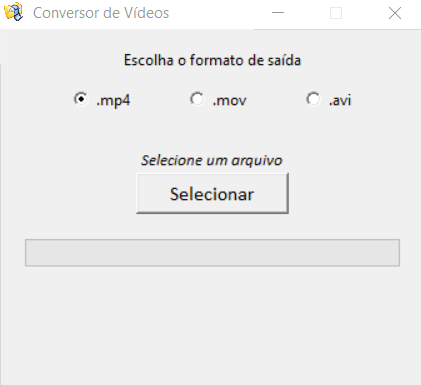
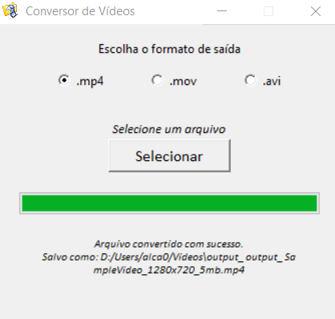

<h1 align="center">
    
</h1>

<h1 align="center">
  	Video converter with tkinter + opencv
</h1>

## Run

### Clone repo
```sh
# Clone this repo
git clone https://github.com/andre23arruda/python-video-converter

```

__Windows__
- You can run this app with double click at  __dist/video_converter.exe__

__Linux__
- You can run this app with double click at  __dist/run_video_converter.sh__

or
```sh
# For this, you need python installed

# create virtual enviroment
python -m venv venv
# or
# python3 -m venv venv

# activate virtual enviroment
activate_venv.sh

# install required packages
pip install -r requirements.txt

# run
python main.py
```


<div align="center">
    
    
</div>